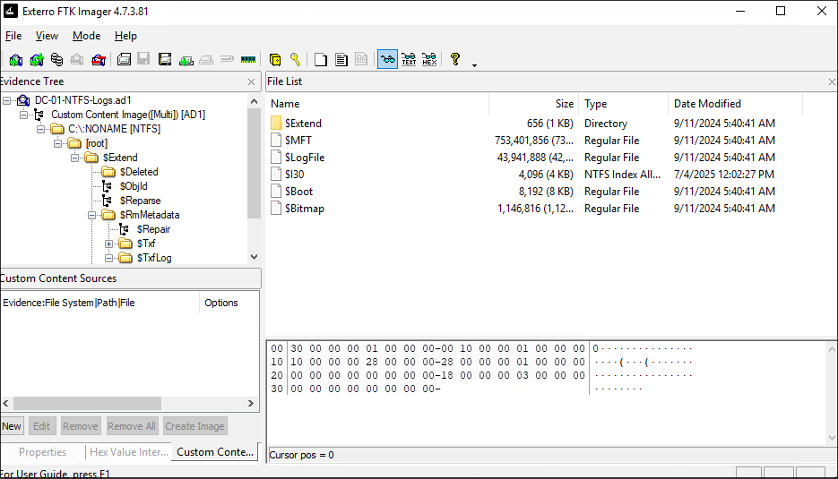
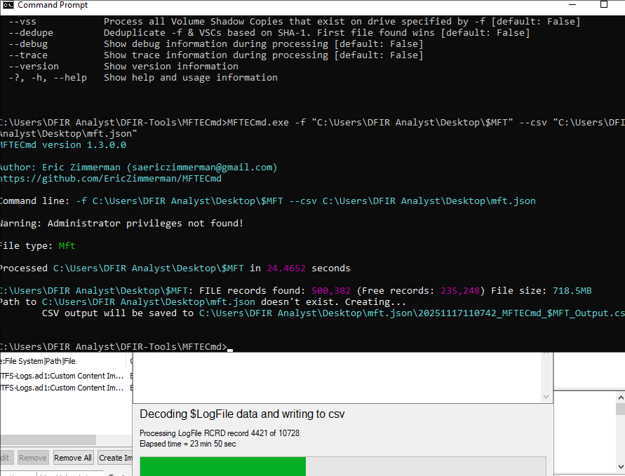
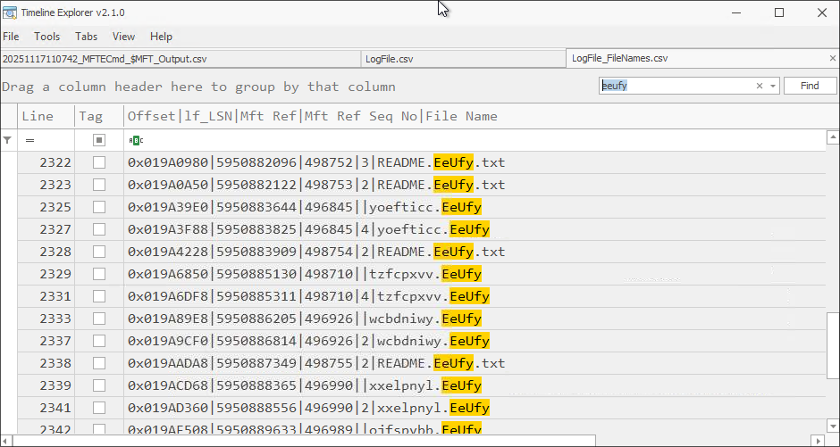
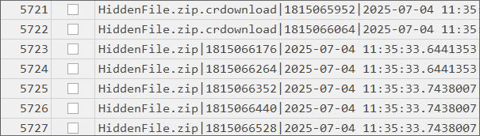
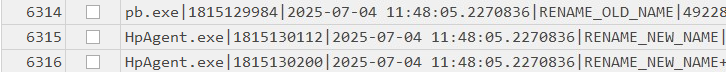
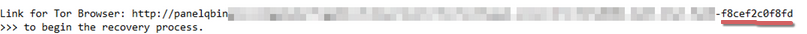

[Shock and Silence](https://tryhackme.com/room/shockandsilence) is a Data forensics room available on Tryhackme which focus on tracing the steps of a ransomware downloaded on the system. Data forensics is a new field for me, and the machine was a new entry so I thought "why not". Important to note is that this room is the fifth room in a series of rooms that can be found by looking up "Honeynet Collapse".

Regardless, some important info I was given:

    - All the resources that you need are on the user's Desktop:
    C:\Users\DFIR Analyst\Desktop
    - Disk image containing NTFS logs is located at:
    .\Artifacts\DC-01-NTFS-Logs.ad1
    - Analysis tools are located at: .\DFIR-Tools\*

Checking the `DFIR-Tool`folder gave me three tools:

- LogFileParser: A tool used to parse and create CSV's out of $LogFiles (I think).
- MFTECmd: A tool used to parse Master File Table entries.
- TimelineExplorer: Utility for viewing the CSV's generated by LogFileParser

My game plan is to generate the CSV's using LogFileParser, Get some info about whatever files I could find within the generated CSV's, including the ransomware. And finally, use TimelineExplorer to trace the ransomware's activity from start to finish.

(note: I had to move LogFileParser to the Public user folder as it kept complaining about not supporting path's with whitespace)

Let's start by launching Exterro FTK Imager. I will use this to extract any important files in the provided `.ad1` image. This includes the $MFT, $LogFile, and the root directory from the image.

I Will first extract the $LogFile and send it to the parser. This process was taking a very long time so while that was being done, I also extracted the $MFT to create a CSV using MFTECmd to sniff out anything notable.

I will then use TimelineExplorer to view the $MFT to look for anything interesting. Common sense is telling me to look into the downloads folder. I did just that and found a `HiddenFile` direcory which housed a pb.exe and a `README.EeUfy.txt`. Actually the README file was stored in every directory belonging to the user `matthew.collins`. Plus, there were a bunch of files with the extension `EeUfy`, further suggesting that pb.exe is our culprit.

(quick note: this is a screenshot of Logfile_filename, not MTF. Just trust me when I say MTF had those same entries.)

That answers Q2 and Q4. Now, let's check out the results of the $LogFile. 

There are quite a few to say the least. but a quick search suggested that `ifusnjrnl` might be my best shot. As it stores a record of the changes made to every(?) file. Looking up `pb.exe` and scrolling up shows that the `HiddenFile` directory was actually extracted from a zip file downloaded using chrome.

This is good, as that means we can find the origin of this file from a zone identifier ([thank you 0xdf](https://0xdf.gitlab.io/2024/04/17/htb-sherlock-bft.html)). It was also at this point that I had found out Exferro is able to mount `.ad1` images.

I then returned to the $MTF file and searched for any reference to `HiddenFile.zip`. And sure enough:

The second file in the search result contained a Referrer URL pointing to a Gofile URL, which answers Q1.

Q2 asks which executable initiated the encryption process. My strategy was to follow whatever proceeds after the `pb.exe` executable. The only executable that came after (that wasn't a windows executable) was `HpAgent.exe`

After which the README files began showing up. This is probably not how I was to supposed to deduce which executable began encrypting, but it lead me to the right file. So there's that I suppose.

Q5 is probably the hardest question to answer. The question asks who is the group behind the attack. One possible lead would be the README file. Looking closer, we see a part of the tor hidden service link was not censored.

Spending some time searching and dorking, I managed to find [this](https://tria.ge/250610-cs7dvaxtdy) site which has the same ransom message as the one presented on the THM page. We can access the hidden service (specifically the blog) in order to retrieve our final answer.

This room was quite the entry when it comes to Digital forensics. 

