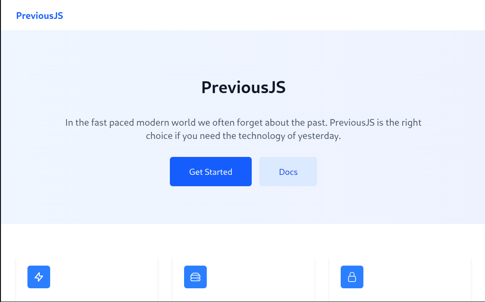

[Previous](https://app.hackthebox.com/machines/Previous) is a medium difficulty Linux machine hosted on hackthebox. The title suggests that we may have to deal with something "previous". Probably git diffs, logs, snapshots, etc.

Let's start with an Nmap scan
```
nmap -A -T4 -v previous.htb
```
As usual we'll also do a full-range and UDP scan in the background.

```
Nmap scan report for previous.htb (10.10.11.83)
Host is up (0.15s latency).
Not shown: 998 closed tcp ports (reset)
PORT   STATE SERVICE VERSION
22/tcp open  ssh     OpenSSH 8.9p1 Ubuntu 3ubuntu0.13 (Ubuntu Linux; protocol 2.0)
| ssh-hostkey: 
|   256 3e:ea:45:4b:c5:d1:6d:6f:e2:d4:d1:3b:0a:3d:a9:4f (ECDSA)
|_  256 64:cc:75:de:4a:e6:a5:b4:73:eb:3f:1b:cf:b4:e3:94 (ED25519)
80/tcp open  http    nginx 1.18.0 (Ubuntu)
|_http-title: PreviousJS
| http-methods: 
|_  Supported Methods: GET HEAD
|_http-server-header: nginx/1.18.0 (Ubuntu)
Device type: general purpose
Running: Linux 5.X
```

Heading on over to the website, it seems to be a front for some company named "Previous corp" advertising the following:



Clicking on both "Get started" and "Docs" leads to a login page.

Wappalyzer shows that this is running on top of a next.js framework, among other things. 


Particularly noteworthy thing is that this is running next.js v15.2.2, which is vulnerable to [CVE-2025-29927](https://nvd.nist.gov/vuln/detail/CVE-2025-29927). And the website says that it has opt-out middleware.

Let's try to exploit this before going forward. I'll do this by intercepting the request to access the docs. After which, I'll add `x-middleware-subrequest: middleware` alongside the other headers.

This didn't work but it's important to note that there are many different payloads for this one exploit. Some scouring reveals that `middleware:middleware:middleware:middleware:middleware` does the job nicely


With that, I was able to get in the docs. 


Not much to see in here. "Getting Started" just shows some requirements and instructions to install a yet-to-be-released library. Examples provides a typescript file.

```
import { app } from 'previous';

const app = new App();
app.start();
```


looking at my feroxbuster results:

```
308      GET        1l        1w       26c http://previous.htb/_next/static/chunks/pages/ => http://previous.htb/_next/static/chunks/pages
308      GET        1l        1w       12c http://previous.htb/application/ => http://previous.htb/application
308      GET        1l        1w       35c http://previous.htb/_next/static/qVDR2cKpRgqCslEh-llk9/ => http://previous.htb/_next/static/qVDR2cKpRgqCslEh-llk9
308      GET        1l        1w       13c http://previous.htb/_next/static/ => http://previous.htb/_next/static
308      GET        1l        1w       17c http://previous.htb/_next/static/css/ => http://previous.htb/_next/static/css
308      GET        1l        1w        6c http://previous.htb/_next/ => http://previous.htb/_next
200      GET        1l        2w       77c http://previous.htb/_next/static/qVDR2cKpRgqCslEh-llk9/_ssgManifest.js
308      GET        1l        1w       20c http://previous.htb/_next/static/chunks/ => http://previous.htb/_next/static/chunks
200      GET        1l      283w     5101c http://previous.htb/_next/static/chunks/pages/index-a09f42904785092c.js
200      GET        1l        1w     1305c http://previous.htb/_next/static/qVDR2cKpRgqCslEh-llk9/_buildManifest.js
200      GET        1l      725w    33690c http://previous.htb/_next/static/chunks/pages/_app-95f33af851b6322a.js
200      GET        1l       60w     3028c http://previous.htb/_next/static/chunks/webpack-cb370083d4f9953f.js
200      GET        1l      250w    23885c http://previous.htb/_next/static/css/9a1ff1f4870b5a50.css
308      GET        1l        1w        5c http://previous.htb/docs/ => http://previous.htb/docs
200      GET        1l      217w     8862c http://previous.htb/_next/static/chunks/0-c54fcec2d27b858d.js
200      GET        1l      124w     3663c http://previous.htb/_next/static/chunks/pages/docs-5f6acb8b3a59fb7f.js
200      GET        1l       91w     5893c http://previous.htb/_next/static/chunks/8-fd0c493a642e766e.js
200      GET        1l     2125w   112594c http://previous.htb/_next/static/chunks/polyfills-42372ed130431b0a.js
200      GET        1l      181w     3353c http://previous.htb/docs
200      GET        1l       38w     1467c http://previous.htb/docs/getting-started
200      GET        1l       38w     1467c http://previous.htb/docs/api-reference
200      GET        1l       38w     1467c http://previous.htb/docs/examples
200      GET        1l     2412w   119495c http://previous.htb/_next/static/chunks/main-0221d9991a31a63c.js
200      GET        1l     2734w   139924c http://previous.htb/_next/static/chunks/framework-ee17a4c43a44d3e2.js
200      GET        1l      407w     5493c http://previous.htb/
200      GET        1l      136w     3480c http://previous.htb/_next/static/chunks/pages/signin-d0284ed11872b445.js
200      GET        1l      179w     3481c http://previous.htb/signin
```

We do have an `_app` javascript file. looking into it, it seems to be a heavily obfuscated version of the current webpage. Nevertheless, I decided to put this on hold as I remembered something.

When I was trying to access the docs, I saw that the signin page had a parameter called `callbackURL` which was assigned something like: `http://localhost:3000/docs` (albeit encoded).